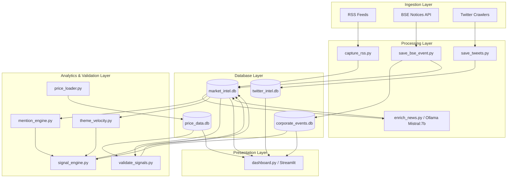
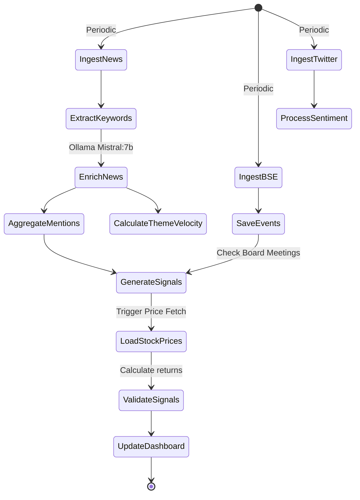
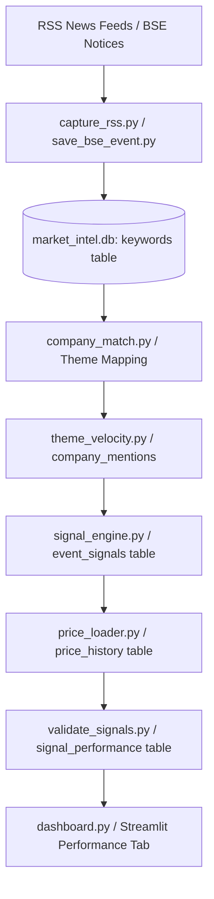

# Architecture Reference: MARKET_INTEL

This document outlines the system architecture, database relationships, workflow dependencies, and signal validation pipelines for the `MARKET_INTEL` platform.

---

## 1. System Architecture

The platform uses a layered architecture, decoupling ingestion, database storage, analysis, and presentation.



---

## 2. Database Relationships

The system manages four separate SQLite databases, which are joined logically in the analytics and validation layers.

```mermaid
erDiagram
    %% market_intel.db
    KEYWORDS {
        int id PK
        string title
        string raw_text
        string keywords
        string source
        string created_at
        string related_companies
        string theme
        string link
        int processed
        string sentiment
        string impact_score
        string source_timestamp
        string system_timestamp
    }

    COMPANY_MENTIONS {
        string company PK
        string date PK
        int mentions
    }

    THEME_VELOCITY {
        string theme PK
        string date PK
        int mentions_today
        float avg_7d
        float avg_30d
        float z_score
    }

    EVENT_SIGNALS {
        int id PK
        string company FK
        string signal_date
        float velocity
        int today_mentions
        float avg_mentions
        int event_id FK
        string event_type
        string event_date
        string event_description
        string signal_strength
        datetime created_at
    }

    SIGNAL_PERFORMANCE {
        int signal_id PK
        string company FK
        string signal_date
        float price_at_signal
        float price_5d_later
        float price_10d_later
        float return_5d
        float return_10d
        string outcome
        datetime updated_at
    }

    %% price_data.db
    PRICE_HISTORY {
        string symbol PK
        string date PK
        float open
        float high
        float low
        float close
        float adj_close
        int volume
        datetime created_at
    }

    %% corporate_events.db
    CORPORATE_EVENTS {
        int id PK
        string company_symbol
        string event_date
        string event_type
        string description
        string source
        string guid
        datetime created_at
    }

    BOARD_MEETINGS {
        int id PK
        string company_symbol
        string meeting_date
        string purpose
        string source
        string guid
        datetime created_at
    }

    FINANCIAL_RESULTS {
        int id PK
        string company_symbol
        string quarter
        string financial_year
        float revenue
        float net_profit
        string outcome_summary
        string guid
        datetime created_at
    }

    %% In-Memory or Logical Joins
    KEYWORDS ||--o{ COMPANY_MENTIONS : "aggregates to"
    KEYWORDS ||--o{ THEME_VELOCITY : "aggregates to"
    COMPANY_MENTIONS ||--o{ EVENT_SIGNALS : "triggers"
    CORPORATE_EVENTS ||--o{ EVENT_SIGNALS : "validates"
    BOARD_MEETINGS ||--o{ EVENT_SIGNALS : "validates"
    FINANCIAL_RESULTS ||--o{ EVENT_SIGNALS : "validates"
    EVENT_SIGNALS ||--|| SIGNAL_PERFORMANCE : "evaluates (one-to-one)"
    PRICE_HISTORY ||--o{ SIGNAL_PERFORMANCE : "supplies prices"
```,StartLine:163,TargetContent:
```

---

## 3. Workflow Dependencies

The execution pipeline must follow a specific logical order to ensure that signals are generated from fresh data and then validated.



---

## 4. Signal Ingestion & Processing Flow

This flowchart illustrates how a raw RSS article transforms into a validated quantitative trade signal shown on the Streamlit dashboard.


