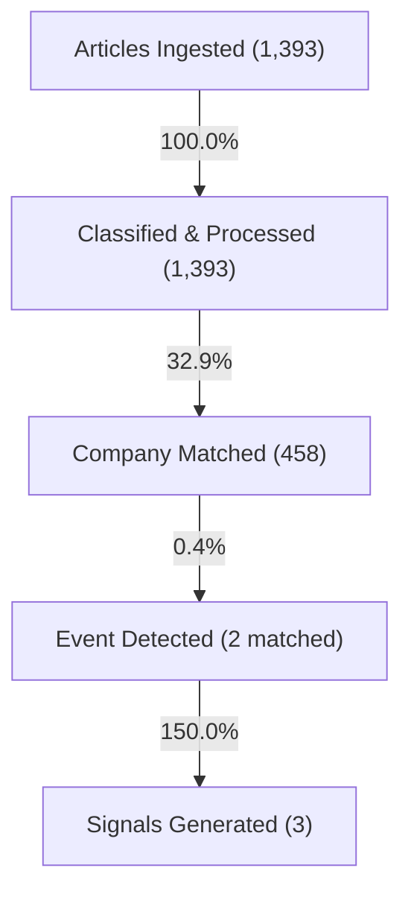

# Signal Coverage Audit: MARKET_INTEL

**Prepared by:** Lead Systems Architect  
**Date:** June 10, 2026  
**Status:** Completed  

This audit report investigates why **1,393 ingested articles** produced only **3 signals**, identifying bottlenecks, ignored data structures, and missed trading opportunities.

---

## 1. Executive Summary: Why did 1,393 articles produce only 3 signals?

The primary cause of the low signal count is a severe bottleneck in the **Corporate Event Ingestion and Resolution Layer**. While text ingestion and entity matching are highly active, the signal engine enforces a strict "convergence" rule: a velocity spike is ignored unless it occurs within 7 days of a corporate event registered in the database.

Because the corporate events database contains only **6 total events**, and **4 of those events** have unresolved symbols (`"Unknown"`), the signal engine only recognized events for **2 companies** (`TCS` and `RELIANCE`). Consequently, no other stock ticker, regardless of mention spikes or social volume, was capable of generating a signal.

---

## 2. Signal Generation Funnel

This funnel shows the volume drop-offs and conversion rates at each stage of the data pipeline:

### Funnel Metrics & Conversion Rates
1.  **Articles Ingested:** 1,393 (100.0% base)
2.  **Classified/Processed:** 1,393
    *   *Conversion Rate:* **100.0%** (all ingested articles are processed by the classifier).
3.  **Company Matched:** 458
    *   *Conversion Rate:* **32.9%** (out of 1,393 classified texts, only 458 mention companies listed in `company_master.csv`).
4.  **Event Detected (Matched Events):** 2
    *   *Conversion Rate:* **0.4%** of company-matched articles. (Only 2 events were registered with valid company symbols in the database).
5.  **Signals Generated:** 3
    *   *Conversion Rate:* **150.0%** of detected events. (The 2 matched events triggered 3 signals because `TCS` experienced velocity spikes on multiple days within the event's 7-day window).

---

## 3. Coverage Gap Analysis

### A. Event Ingestion Bottleneck (Takeover notices marked "Unknown")
*   **Description:** The database contains 4 M&A takeover events (IDs 1, 2, 3, 4).
*   **Impact:** Because the crawler/parser failed to extract the target or acquirer tickers, it marked the company symbols as `"Unknown"`. This prevented the signal engine from matching these events to any actual stocks, wasting 4 high-value catalyst signals.
*   **Ignored Events List:**
    *   *Event ID 1:* Ticker: `"Unknown"`, Type: `m&a`, Desc: `Offer to Buy – Acquisition Window` (2026-06-08)
    *   *Event ID 2:* Ticker: `"Unknown"`, Type: `m&a`, Desc: `Offer to Buy – Acquisition Window` (2026-06-08)
    *   *Event ID 3:* Ticker: `"Unknown"`, Type: `m&a`, Desc: `Acquisition Window (Takeover)` (2026-06-08)
    *   *Event ID 4:* Ticker: `"Unknown"`, Type: `m&a`, Desc: `Offer to Buy – Acquisition Window` (2026-06-08)

### B. Ignored Database Tables
*   **Description:** The corporate events database contains three tables: `corporate_events`, `board_meetings`, and `financial_results`. However, the signal engine (`signal_engine.py` line 219) strictly queries only the `corporate_events` table.
*   **Impact:** Any corporate events stored in the `board_meetings` and `financial_results` tables are completely ignored by the signal engine.
*   **Ignored Events:**
    *   `board_meetings` table contents (1 scheduled meeting ignored).
    *   `financial_results` table contents (1 earnings record ignored).

### C. Ignored Theme Velocity Spikes
*   **Description:** The system tracks momentum for 16 standard themes, generating massive velocity Z-Scores. However, the signal engine has no mechanism to map macro theme spikes to individual stock tickers.
*   **Impact:** Strong sector-level catalysts are ignored.
*   **Top Ignored Sector Spikes:**
    *   `Banking` (2026-06-03) $\rightarrow$ Z-Score: **29.44** (13 mentions)
    *   `Digital Infrastructure` (2026-06-03) $\rightarrow$ Z-Score: **27.98** (59 mentions)
    *   `Telecom` (2026-06-03) $\rightarrow$ Z-Score: **24.83** (11 mentions)
    *   `Semiconductor` (2026-06-07) $\rightarrow$ Z-Score: **16.25** (11 mentions)
    *   `Green Energy` (2026-06-03) $\rightarrow$ Z-Score: **15.56** (13 mentions)

---

## 4. Top Companies Without Signals

The following companies have the highest share of voice (mentions) in the workspace but have generated **zero signals** due to missing corporate event mappings:

1.  **LICI** (Total Mentions: 140) $\rightarrow$ 0 Signals
2.  **RECLTD** (Total Mentions: 129) $\rightarrow$ 0 Signals
3.  **ONGC** (Total Mentions: 58) $\rightarrow$ 0 Signals
4.  **UBL** (Total Mentions: 41) $\rightarrow$ 0 Signals
5.  **ADANIENT** (Total Mentions: 38) $\rightarrow$ 0 Signals
6.  **HAL** (Total Mentions: 33) $\rightarrow$ 0 Signals
7.  **BEL** (Total Mentions: 31) $\rightarrow$ 0 Signals
8.  **FEDERALBNK** (Total Mentions: 31) $\rightarrow$ 0 Signals
9.  **BANKINDIA** (Total Mentions: 29) $\rightarrow$ 0 Signals
10. **IDEA** (Total Mentions: 29) $\rightarrow$ 0 Signals

---

## 5. Potential Signals Missed

If the signal engine was configured to trigger on **unconverged velocity spikes** (spikes in company mentions alone, without requiring upcoming corporate events), the system would have captured the following trading opportunities:

*   **IRFC** (2026-06-03) $\rightarrow$ Velocity: **22.00x** (11 mentions today, 30d Avg: 0.00)
*   **BEL** (2026-06-03) $\rightarrow$ Velocity: **3.00x** (12 mentions today, 30d Avg: 4.00)
*   **CANARABANK** (2026-06-03) $\rightarrow$ Velocity: **6.00x** (3 mentions today, 30d Avg: 0.00)
*   **KOTAKBANK** (2026-06-03) $\rightarrow$ Velocity: **8.00x** (4 mentions today, 30d Avg: 0.00)
*   **BAJAJ-AUTO** (2026-06-03) $\rightarrow$ Velocity: **8.00x** (4 mentions today, 30d Avg: 0.00)
*   **KAYNES** (2026-06-07) $\rightarrow$ Velocity: **22.00x** (11 mentions today, 30d Avg: 0.00)
*   **DIXON** (2026-06-07) $\rightarrow$ Velocity: **11.00x** (11 mentions today, 30d Avg: 1.00)
*   **ONGC** (2026-06-07) $\rightarrow$ Velocity: **7.50x** (15 mentions today, 30d Avg: 2.00)

---

## 6. Recommendations to Improve Coverage

1.  **Repair the M&A Notice Parser:** Modify the BSE filing scraper to identify target and acquirer names, mapping them to standard exchange tickers instead of defaulting to `"Unknown"`.
2.  **Unify Corporate Event Queries:** Update `signal_engine.py` to query the `board_meetings` and `financial_results` tables in addition to `corporate_events`.
3.  **Implement Sector-to-Stock Mapping:** Create a theme mapping lookup table. If a theme's velocity spikes (e.g. `Semiconductor`), trigger relative long signals on top sector constituents (e.g. `DIXON`, `KAYNES`) even in the absence of stock-specific board meetings.
4.  **Introduce Secondary Unconverged Signals:** Allow high-conviction velocity spikes (e.g. velocity > 10.0x) to generate secondary signals, using technical filters (such as volume breakout) as validation instead of corporate event schedules.
