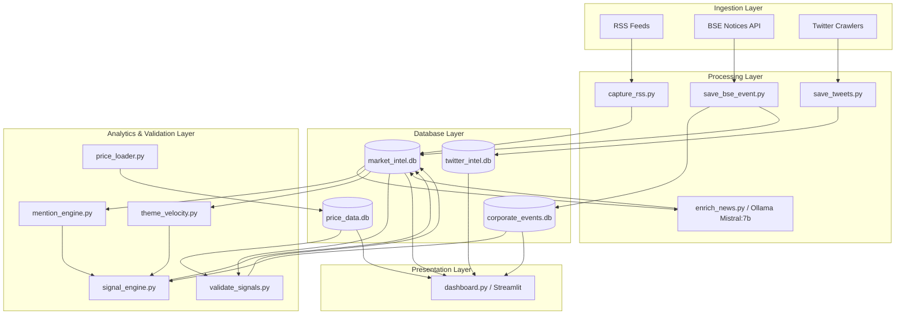
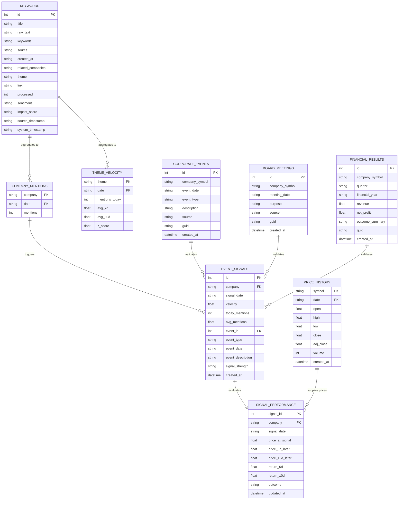

# Market-Intel: Validated Signal Intelligence Platform

[](https://opensource.org/licenses/MIT)
[](https://www.python.org/)
[](https://www.sqlite.org/)
[](https://streamlit.io/)

Market-Intel is an end-to-end, AI-powered quant intelligence platform that ingests news, financial disclosures, and social media signals to detect high-conviction events. It automates the ingestion, local LLM enrichment, signal validation, and return backtesting against real historical stock data, displaying outcomes in a dynamic Streamlit dashboard.

---

## 🚀 Primary Objective
> **"Can this system generate signals that outperform the market?"**
> Market-Intel seeks to isolate pure Alpha ($\alpha$) by tracking mention velocity spikes, correlating them with scheduled corporate events (board meetings, earnings calls, financial disclosures), and benchmarking their performance against the Nifty 50 index.

---

## 🏛️ System Architecture

The platform uses a layered architecture, decoupling ingestion, database storage, analysis, and presentation.



---

## 📂 Repository Structure

The project directory is structured as follows:

```text
D:/MARKET_INTEL/
├── .env                              # API keys, database paths, and environment settings
├── .gitignore                        # Git exclusions for secrets, caches, and databases
├── dashboard.py                      # Main Streamlit web dashboard app
├── context.md                        # Project roles, goals, and preferred output styles
├── MARKET_INTEL_ROADMAP.md           # High-level checklist of project phases
│
├── AUDIT/                            # Logs of unclassified articles for manual review
├── BACKUP/                           # Historical snapshots and code backups (ignored in Git)
│
├── CORPORATE_ENGINE/                 # BSE parsing and corporate filings logic
│   └── save_corp_data.py             # Parses and saves incoming corporate filing data
│
├── DATABASE/                         # SQLite storage layer (split to prevent file locks)
│   ├── market_intel.db               # Main database for news, mentions, velocities, signals
│   ├── price_data.db                 # Historical daily price bars (OHLCV + Adj Close)
│   ├── corporate_events.db           # Official board meetings, results, and disclosures
│   └── twitter_intel.db              # Scraped social media tweets and sentiment tags
│
├── DOCUMENTATION/                    # Centralized knowledge base
│   ├── ARCHITECTURE.md               # Architecture details, ER diagrams, workflows
│   ├── CHANGELOG.md                  # Release log following "Keep a Changelog" format
│   ├── DATABASE_SCHEMA.md            # Database columns, keys, and row counts
│   ├── DECISIONS.md                  # Strategic decision records (Decision -> Reason -> Impact)
│   ├── PROJECT_AUDIT.md              # Detailed file, schema, and workflow audit report
│   ├── PROJECT_STATUS.md             # Development checklists and layer completion boards
│   ├── ROADMAP.md                    # Strategic sprints, goals, ROI tasks, and risk registers
│   └── SESSION_SUMMARY.md            # Chronological run history and log summaries
│
├── LOGS/                             # Runtime log outputs (ignored in Git)
│
├── MAPPINGS/                         # Entity-to-symbol and keyword-to-theme mappings
│   ├── company_master.csv            # Maps company names and variations to exchange tickers
│   └── theme_mappings.csv            # Dictates keyword mappings to the 16 frozen themes
│
├── NEWS_ENGINE/                      # RSS collection and AI enrichment engines
│   ├── capture_rss.py                # Periodically pulls articles and writes raw keywords
│   ├── company_match.py              # Scans texts and resolves mentions to ticker symbols
│   ├── enrich_news.py                # Connects to local Ollama LLM to tag sentiment and impact
│   ├── migration.py                  # Script to inject dual timestamps (source vs system)
│   └── save_keywords.py              # Core insertion script for raw articles
│
├── PRICE_ENGINE/                     # Historical stock price loader
│   └── price_loader.py               # Fetches daily historical Yahoo Finance prices incrementally
│
├── SIGNAL_ENGINE/                    # Signal calculation and outcome validator scripts
│   └── validate_signals.py           # Quantitative backtester checking 5d/10d holds from next-day Open
│
├── SOCIAL_ENGINE/                    # Playwright scraper scripts for social media
│   ├── convert_cookies.py            # Utility to convert browser cookie formats
│   └── save_tweets.py                # Crawls target social accounts using cookies
│
└── WORKFLOWS/                        # JSON blueprints for n8n orchestrations
    ├── bse_ingestion.json            # n8n notice scraper trigger
    ├── capture_workflow.json         # RSS feed poller trigger
    ├── daily_briefing_workflow.json  # Runs daily summary briefings
    ├── enrichment_workflow.json      # Triggers Ollama enrichment calls
    └── twitter_ingestion.json        # Twitter playwright cron trigger
```

---

## 🛢️ Database Schema & Relationships

The system manages four separate SQLite databases, which are joined logically in the analytics and validation layers:



---

## 🛠️ Installation & Setup

### 1. Clone the Repository
```bash
git clone https://github.com/sandeshavere-oss/Market-Intel.git
cd Market-Intel
```

### 2. Configure Environment Variables
Create a `.env` file in the root directory:
```env
X_USERNAME=your_x_username
X_PASSWORD=your_x_password
X_EMAIL=your_x_email
```

### 3. Install Dependencies
```bash
pip install -r requirements.txt
```
*(Make sure to run playwright install if using the Twitter scraper)*
```bash
playwright install
```

### 4. Run Streamlit Dashboard
```bash
streamlit run dashboard.py
```

---

## 🔄 Run Pipelines

Data collection and enrichment pipelines are orchestrated via the `WORKFLOWS/*.json` n8n definitions, or can be triggered manually:
1. **RSS Ingestion:** Run `python NEWS_ENGINE/capture_rss.py`.
2. **AI Enrichment:** Run `python NEWS_ENGINE/enrich_news.py` (requires local Ollama server running `mistral:7b` or your chosen model).
3. **Price Fetcher:** Run `python PRICE_ENGINE/price_loader.py`.
4. **Signal Engine:** Run `python NEWS_ENGINE/signal_engine.py` or equivalent signal calculations.
5. **Backtest/Validation:** Run `python SIGNAL_ENGINE/validate_signals.py` to evaluate outcome performance.
