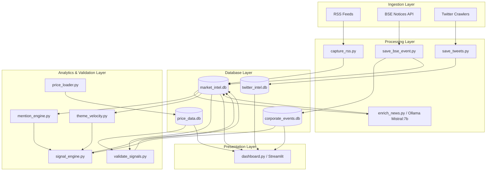

# Market-Intel: Validated Signal Intelligence Platform

<p align="center">
  
</p>

<p align="center">
  <a href="https://github.com/sandeshavere-oss/Market-Intel/actions"></a>
  <a href="https://www.python.org/"></a>
  <a href="https://streamlit.io/"></a>
  <a href="https://www.sqlite.org/"></a>
  <a href="https://github.com/sandeshavere-oss/Market-Intel/blob/main/LICENSE"></a>
</p>

---

Market-Intel is an institutional-grade, AI-driven quantitative events platform that ingests, structures, and validates financial signals. By cross-referencing real-time news mention velocities with scheduled corporate events (earnings releases, board meetings, stock splits), it isolates and measures pure **Alpha ($\alpha$)** relative to the Nifty 50 benchmark.

---

## 🏛️ System Architecture & Workflow

The platform leverages a decoupled, multi-layered architecture:



---

## ✨ Features

*   **Multi-Source Ingestion**: Pulls raw headlines and attachments from RSS feeds, Twitter/X quant handles, and the Bombay Stock Exchange (BSE) announcements board.
*   **BSE PDF Parser**: Intercepts PDF announcement links, downloads them, extracts textual data, and runs event classification.
*   **Local LLM Structuring**: Employs a zero-context Ollama Mistral:7b model locally to extract keywords, companies, and themes, with rule-based fallback paths in case of API timeouts.
*   **Theme Mapping Safeguards**: Categorizes inputs across 16 frozen core thematic indexes (e.g. AI, Space Economy, EV, Defence) and isolates unrecognized entries in a backlog mapping file.
*   **Linear Backtesting Validation**: Evaluates signals over 5-day/10-day holding intervals. Executes buy orders strictly at the **next-day Open price** to avoid execution-bias and slippage anomalies.
*   **Benchmark Index Relative Returns**: Normalizes returns against matching Nifty 50 performance to isolate true outperformance returns ($\alpha$).
*   **Glassmorphic Streamlit Dashboard**: Sleek dark UI with modern fonts (Outfit), metric tiles, timeline graphs, and a recent signal outcomes panel.

---

## 📂 Repository Organization

```text
D:/MARKET_INTEL/
├── .github/                          # GitHub community & issue templates
├── .env                              # API keys, database paths, and environment settings
├── .gitignore                        # Git exclusions for secrets, caches, and databases
├── CONTRIBUTING.md                   # Open-source contributing guidelines
├── CHANGELOG.md                      # Changelog following "Keep a Changelog" format
├── MARKET_INTEL_ROADMAP.md           # Investor-focused developer roadmap
│
├── dashboard/
│   └── dashboard.py                  # Main Streamlit web dashboard application
│
├── data/                             # Project assets and CSV tables
│   ├── mappings/                     # Entity-to-symbol and keyword-to-theme maps
│   └── audit/                        # Logs of unclassified articles for manual review
│
├── database/                         # SQLite storage layer (split to prevent file locks)
│   ├── market_intel.db               # Main database for news, mentions, velocities, signals
│   ├── price_data.db                 # Historical daily price bars (OHLCV + Adj Close)
│   ├── corporate_events.db           # Official board meetings, results, and disclosures
│   └── twitter_intel.db              # Scraped social media tweets and sentiment tags
│
├── docs/                             # Project documentation
│   ├── assets/                       # Images, logo placeholders, and banners
│   ├── PROJECT_OVERVIEW.md           # Methodology, mention velocities, and ERD logic
│   ├── DATA_PIPELINE.md              # Ingestion frequency, scraping, and LLM schemas
│   └── DATABASE_SCHEMA.md            # SQLite column data types and mapping layouts
│
├── logs/                             # Runtime log output directory (ignored in Git)
│
├── scripts/                          # Quantitative analysis and processing engines
│   ├── news_engine/                  # RSS capture, LLM enrichment, and theme velocity
│   ├── price_engine/                 # Incremental Yahoo Finance historical price syncer
│   ├── signal_engine/                # Event signals overlap and Z-score calculation
│   ├── social_engine/                # Playwright scrapers and Twitter cookie helpers
│   └── corporate_engine/             # BSE filing notices parsing logic
│
└── WORKFLOWS/                        # JSON blueprints for n8n orchestrations
```

---

## 🛠️ Installation & Setup

### 1. Clone the Repository
```bash
git clone https://github.com/sandeshavere-oss/Market-Intel.git
cd Market-Intel
```

### 2. Configure Environment Variables
Create a `.env` file in the root directory:
```env
X_USERNAME=your_x_username
X_PASSWORD=your_x_password
X_EMAIL=your_x_email
```

### 3. Install Dependencies
```bash
pip install -r requirements.txt
playwright install
```

### 4. Initialize local Ollama model
Ensure you have [Ollama](https://ollama.com) installed and the Mistral model pulled:
```bash
ollama run mistral:7b
```

---

## 🚀 Quick Start Guide

### 1. Start the Streamlit Dashboard
```bash
streamlit run dashboard/dashboard.py
```

### 2. Manually Trigger Data Syncer
*   **Sync News & Scrape PDFs**: `python scripts/news_engine/capture_rss.py`
*   **Run LLM Enrichment Pipeline**: `python scripts/news_engine/enrich_news.py`
*   **Sync Historical Prices**: `python scripts/price_engine/price_loader.py`
*   **Validate Signal Performance**: `python scripts/signal_engine/validate_signals.py`

---

## ⚠️ Disclaimer
*This project is for educational and research purposes only. Market-Intel does not provide financial or investment advice. Algorithmic and quantitative trading carries substantial risk of financial loss. Past performance of signals is not indicative of future results.*
