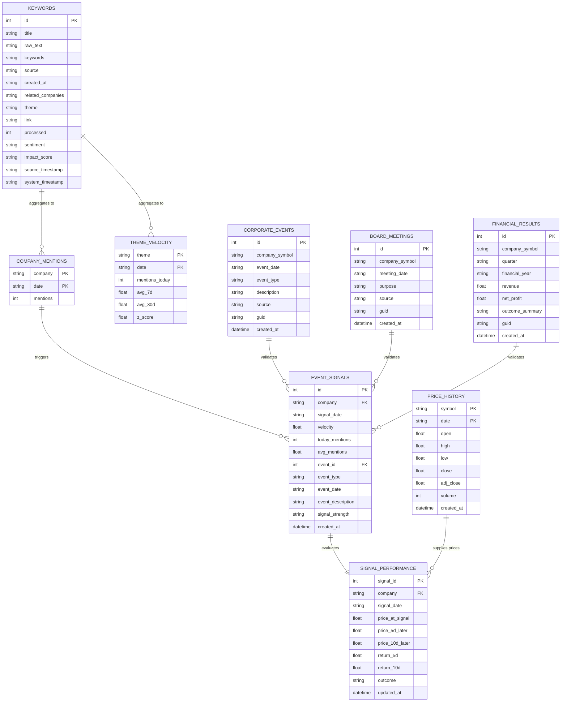

# Database Schema Reference: Market-Intel

Market-Intel splits its storage across four separate SQLite database files. This prevents file lock contention during parallel data ingestion (such as active Twitter scraping, RSS polling, and price syncing happening concurrently).

---

## 🏛️ Relational ERD Diagram

The databases are joined logically within the analytics, validation, and presentation layers:

---

## 🛢️ 1. Main Database: `market_intel.db`

### Table: `keywords`
Stores captured articles, extracted entities, mapped themes, and processing flags.
| Column | Type | Constraints | Description |
| :--- | :--- | :--- | :--- |
| `id` | INTEGER | PRIMARY KEY AUTOINCREMENT | Unique record ID |
| `title` | TEXT | | Title of the article/notice |
| `raw_text` | TEXT | | Full extracted content or PDF transcript |
| `keywords` | TEXT | | Comma-separated key phrases |
| `source` | TEXT | | Source (e.g., RSS, Moneycontrol, BSE) |
| `created_at` | TEXT | | Timestamp when ingested |
| `related_companies`| TEXT | | Pipes-separated matched tickers (e.g., `TCS.NS\|INFY.NS`) |
| `theme` | TEXT | | Pipes-separated standardized themes (e.g., `AI\|EV`) |
| `link` | TEXT | UNIQUE | URL/link of the source article |
| `processed` | INTEGER | DEFAULT 0 | 0 = Unprocessed, 1 = Structuring Complete |
| `sentiment` | TEXT | | Sentiment tag (Positive, Negative, Neutral) |
| `impact_score` | TEXT | | Impact score (High, Medium, Low) |
| `source_timestamp` | TEXT | | Original publication timestamp |
| `system_timestamp` | TEXT | | Ingestion system timestamp |
| `enriched_at` | TEXT | | Timestamp of LLM enrichment |

### Table: `company_mentions`
Chronological aggregate of company discussions.
| Column | Type | Constraints | Description |
| :--- | :--- | :--- | :--- |
| `company` | TEXT | PRIMARY KEY (with date) | Resolved ticker symbol |
| `date` | TEXT | PRIMARY KEY (with company) | Date of mention (YYYY-MM-DD) |
| `mentions` | INTEGER | | Count of mentions on this date |

### Table: `theme_velocity`
Saves Z-scores and rolling baselines of theme popularity.
| Column | Type | Constraints | Description |
| :--- | :--- | :--- | :--- |
| `theme` | TEXT | PRIMARY KEY (with date) | Frozen theme name |
| `date` | TEXT | PRIMARY KEY (with theme) | Evaluation date |
| `mentions_today` | INTEGER | | Mentions count today |
| `avg_7d` | REAL | | 7-day rolling baseline average |
| `avg_30d` | REAL | | 30-day rolling baseline average |
| `z_score` | REAL | | Statistically normalized spike ratio |

### Table: `event_signals`
Calculated quantitative trade event signals.
| Column | Type | Constraints | Description |
| :--- | :--- | :--- | :--- |
| `id` | INTEGER | PRIMARY KEY AUTOINCREMENT | Unique signal ID |
| `company` | TEXT | | Listed ticker symbol |
| `signal_date` | TEXT | | Date signal was triggered |
| `velocity` | REAL | | Mention velocity ratio |
| `today_mentions` | INTEGER | | Count of mentions today |
| `avg_mentions` | REAL | | 30-day baseline average mentions |
| `event_id` | INTEGER | | Foreign key referencing calendar event |
| `event_type` | TEXT | | Class (e.g., Board Meeting, Dividend) |
| `event_date` | TEXT | | Scheduled event date |
| `event_description`| TEXT | | Purpose/Description of the corporate event |
| `signal_strength` | TEXT | | Calculated power of signal (High/Medium/Low) |
| `created_at` | TEXT | | Timestamp when signal was generated |

---

## 🛢️ 2. Price Database: `price_data.db`

### Table: `price_history`
Maintains daily historical OHLCV pricing for listed companies and market benchmarks.
| Column | Type | Constraints | Description |
| :--- | :--- | :--- | :--- |
| `symbol` | TEXT | PRIMARY KEY (with trade_date)| Exchange ticker symbol (e.g., `NIFTY50`) |
| `trade_date` | TEXT | PRIMARY KEY (with symbol) | Trade date (YYYY-MM-DD) |
| `open` | REAL | | Daily opening price |
| `high` | REAL | | Daily highest price |
| `low` | REAL | | Daily lowest price |
| `close` | REAL | | Daily closing price |
| `adj_close` | REAL | | Adjusted close price (split/dividend adjusted) |
| `volume` | INTEGER | | Daily trading volume |
| `created_at` | TEXT | | Sync timestamp |

---

## 🛢️ 3. Corporate Events Database: `corporate_events.db`

### Table: `board_meetings`
Tracks scheduled corporate board meetings.
| Column | Type | Constraints | Description |
| :--- | :--- | :--- | :--- |
| `id` | INTEGER | PRIMARY KEY AUTOINCREMENT | Record ID |
| `company_symbol` | TEXT | | Company ticker symbol |
| `meeting_date` | TEXT | | Scheduled meeting date |
| `purpose` | TEXT | | Agenda/Purpose of the board meeting |
| `source` | TEXT | | Source (e.g., BSE Notice, RSS) |
| `guid` | TEXT | UNIQUE | Unique global ID to prevent duplicates |
| `created_at` | TEXT | | Sync timestamp |

*(Similar structures are defined for `corporate_events` and `financial_results` tables in this database).*
