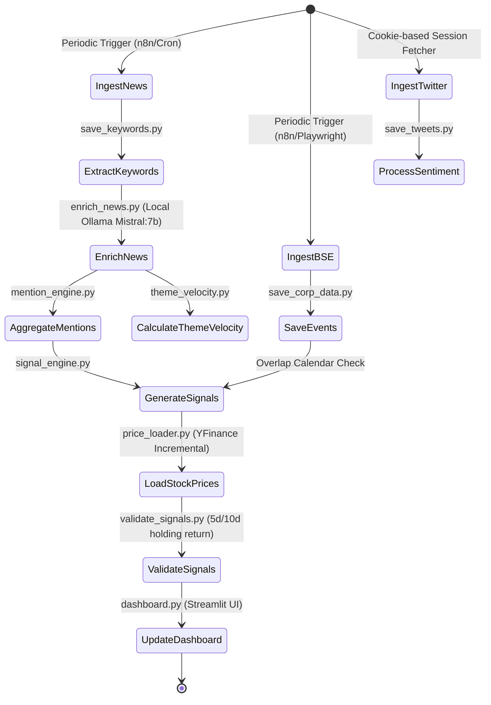
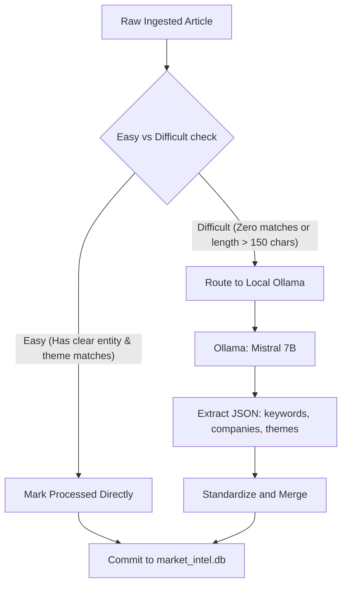

# Data Pipeline Reference: Market-Intel

Market-Intel implements an automated, fault-tolerant quantitative data pipeline that ingests unstructured market narratives, structures them via a local LLM, joins them with exchange filing notices, and validates outcomes against historical daily pricing data.

---

## 🔄 End-to-End Pipeline Workflow

The pipeline operates in three distinct phases: **Ingestion**, **Enrichment & Structuring**, and **Signal & Performance Validation**.



---

## 📥 1. Ingestion Layer

### RSS News Feed Ingestion (`NEWS_ENGINE/capture_rss.py`)
*   Pulls business news feeds periodically (defaulting to Moneycontrol Business Feed).
*   Performs duplication checks based on URL link hashing to avoid duplicate processing.
*   **BSE PDF Intercept**: If the link points to a BSE announcement PDF, the poller downloads the PDF, extracts the raw text using `PdfReader`, and cleans it before database insertion.

### BSE Filings Notice Crawler (`NEWS_ENGINE/save_bse_event.py`)
*   Playwright-based crawler that scrapes official disclosures from the Bombay Stock Exchange (BSE).
*   Extracts the announcement type, header, meeting purpose, and download attachments.
*   Maps raw events to deterministic classes (e.g., Dividend, Board Meeting, Stock Split).

### Twitter Crawlers (`SOCIAL_ENGINE/save_tweets.py`)
*   Scrapes target quantitative finance and market commentary accounts.
*   Utilizes a local cookie converter (`convert_cookies.py`) that exports browser cookies to load active sessions, avoiding API rate limits and login CAPTCHA blocks.
*   Saves tweets to `twitter_intel.db` with automated auto-cleanup of records older than 30 days to optimize storage.

---

## ⚙️ 2. Processing & LLM Enrichment (`NEWS_ENGINE/enrich_news.py`)

To parse messy and ambiguous article texts, the system routes articles through a **Dual-Path Structuring Pipeline**:



### LLM Structuring Specification
The enrichment engine queries a local Ollama server running `mistral:7b` with a zero-temperature prompt. The model is instructed to return a strict JSON schema:
```json
{
  "keywords": "comma-separated list of entities",
  "companies": ["symbol1", "symbol2"],
  "themes": ["theme1", "theme2"]
}
```
*   **Fallback Classifiers**: If Ollama is offline or times out, the script gracefully falls back to deterministic rule-based sentiment and impact analysis classifiers.

---

## 📈 3. Signal & Performance Validation (`SIGNAL_ENGINE/validate_signals.py`)

The validation pipeline calculates exact holding returns to audit the generated signals:

1.  **Incremental Daily Price Ingestion (`PRICE_ENGINE/price_loader.py`)**:
    *   Incremental Yahoo Finance loader that pulls adjusted daily Close, Open, High, Low, and Volume data for all listed ticker symbols.
    *   Also tracks `NIFTY50` index pricing to calculate benchmark-relative outperformance.
2.  **Backtest Return Calculation**:
    *   Calculates 5-day and 10-day returns using the **next-day Open price** as the entry point and the respective holding-day **Close price** as the exit point.
    *   This eliminates look-ahead bias and simulates realistic slippage-inclusive execution.
3.  **Outperformance Metric ($\alpha$)**:
    *   $$\text{Relative Return} = \text{Asset Return} - \text{Nifty 50 Return}$$
    *   Categorizes signals as **Outperforming** or **Underperforming** based on relative returns.
