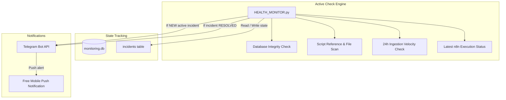

# MARKET_INTEL Monitoring Architecture and Setup Guide

This document describes the design, implementation, and setup of the zero-cost, state-based monitoring system for the `MARKET_INTEL` platform. It covers workflow failure detection, script checks, database integrity, ingestion velocity checks, and free Telegram push notifications.

---

## 1. System Overview

The monitoring system runs as a lightweight suite that checks system health. It utilizes state-based deduplication to alert on failures immediately without spamming notifications, and automatically resolves alerts when the systems heal.



---

## 2. Ingestion & Verification Scopes

### 2.1 Database Integrity Checks
The monitor opens a connection and runs a verification query (`SELECT 1;`) on the four core databases:
1. `market_intel.db`
2. `twitter_intel.db`
3. `corporate_events.db`
4. `price_data.db`

### 2.2 script Checks
1. **Static Checklist**: Ensures key scripts are present on disk (e.g. `capture_rss.py`, `enrich_news.py`, `price_loader.py`, etc.).
2. **Dynamic Workflow Scan**: Queries the live n8n database `workflow_entity` table, parses all command nodes, extracts referenced Python and batch files, and verifies their existence.

### 2.3 24h Ingestion Velocity Checks
Checks row counts matching a sliding 24-hour window, respecting timezone differences (UTC vs. local time):
- **RSS News Articles**: `processed_articles` in `market_intel.db` (Local time)
- **BSE Corporate Events**: `corporate_events` in `market_intel.db` (UTC time)
- **Twitter Ingestions**: `tweets` in `twitter_intel.db` (Local time)
- **Unified Corporate Events**: `corporate_events` in `corporate_events.db` (UTC time)
- **BSE Board Meetings**: `board_meetings` in `corporate_events.db` (UTC time)
- **BSE Financial Results**: `financial_results` in `corporate_events.db` (UTC time)
- **Price History**: `price_history` in `price_data.db` (UTC time)

---

## 3. Incident State Tracking (`monitoring.db`)

To avoid spamming warnings, the monitor manages an SQLite-backed state machine in `DATABASE/monitoring.db`:

```sql
CREATE TABLE IF NOT EXISTS incidents (
    id INTEGER PRIMARY KEY AUTOINCREMENT,
    timestamp DATETIME DEFAULT CURRENT_TIMESTAMP,
    component TEXT,       -- 'database', 'script', 'ingestion', 'n8n_workflow'
    issue_type TEXT,      -- e.g. 'market_intel.db', 'capture_rss.py'
    message TEXT,         -- Alert description text
    status TEXT,          -- 'active' or 'resolved'
    resolved_at DATETIME  -- Resolution timestamp
);
```

### Alert State Machine Flow
1. **Incident Triggered**: A check fails. The monitor queries the database for an active incident matching the `component` and `issue_type`. If none is found, it inserts a new active incident and sends a **New Critical Alert** to Telegram.
2. **Deduplication**: On subsequent runs, if the failure persists, the monitor detects the active incident is already logged and skips sending another message.
3. **Automatic Resolution**: When the check passes, the monitor updates the status of the active incident to `resolved` and sends a **Resolved Alert** to Telegram.

---

## 4. Telegram Alerts Setup Guide

### Step 1: Create a Bot
1. Search for `@BotFather` in Telegram and send `/newbot`.
2. Save the generated **API Token** (e.g. `123456789:ABCdefGhIJKlmNo`).

### Step 2: Get your Chat ID
1. Search for `@userinfobot` in Telegram and click **Start**.
2. Save your numeric **ID** (e.g. `987654321`).

### Step 3: Add to `.env` File
Insert your credentials at `d:\MARKET_INTEL\.env`:
```env
TELEGRAM_BOT_TOKEN=123456789:ABCdefGhIJKlmNo
TELEGRAM_CHAT_ID=987654321
```

---

## 5. Automating the Monitor (Task Scheduler)

To run the monitoring system automatically on Windows, set up two Scheduled Tasks:

### Task 1: Instant Alert Checks (Every 15 Minutes)
1. Open **Task Scheduler** on Windows.
2. Click **Create Basic Task**. Name it `MarketIntel_Instant_Alerts`.
3. Set Trigger to **Daily**, and set it to repeat every **15 minutes** indefinitely.
4. Set Action to **Start a Program**:
   - Program/Script: `python`
   - Arguments: `d:\MARKET_INTEL\HEALTH_MONITOR.py --alert`
   - Start in: `d:\MARKET_INTEL`

### Task 2: Daily Health Report & Summary (Every Night at 9:00 PM)
1. Click **Create Basic Task**. Name it `MarketIntel_Daily_Summary`.
2. Set Trigger to **Daily** at `21:00` (9:00 PM).
3. Set Action to **Start a Program**:
   - Program/Script: `python`
   - Arguments: `d:\MARKET_INTEL\HEALTH_MONITOR.py --summary`
   - Start in: `d:\MARKET_INTEL`

---

## 6. Incident Recovery Runbooks

### 6.1 Missing/Corrupted Databases
- **Symptom**: `Database market_intel.db is MISSING or CORRUPTED`.
- **Action**: Check `d:\MARKET_INTEL\DATABASE\backup` for copies. If totally lost, run `sqlite3 DATABASE/market_intel.db < WORKFLOWS/market_intel_schema.sql` to re-initialize.

### 6.2 Missing Scripts
- **Symptom**: `Missing Script: scripts/news_engine/capture_rss.py`.
- **Action**: Verify the file is in the correct directory. Check git history (`git status`) to restore accidentally deleted files.

### 6.3 Zero Ingestion Alert
- **Symptom**: `Zero Ingestion Alert: RSS News Articles captured 0 records in last 24h`.
- **Action**: Check network connectivity. Verify MoneyControl RSS feeds are online. For Twitter, export fresh cookies from a logged-in browser session to `scripts/social_engine/raw_cookies.json` and run `python scripts/social_engine/convert_cookies.py`.
