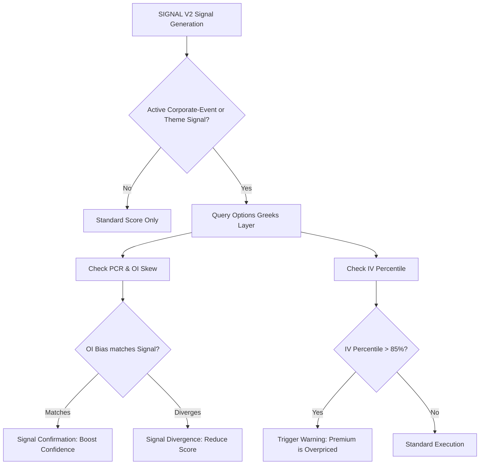

# Options Greeks Layer Notes & Integration Design

This document details the architecture, scraping observations, pre-event test results, and integration design for the new options data layer in `MARKET_INTEL`.

---

## (a) RELIANCE Pre-Event Snapshot Results

We captured a snapshot of the RELIANCE option chain on **June 12, 2026, at 15:30:00 (IST)**, ahead of the June 15 board meeting. The nearest expiry is **June 30, 2026**.

### RELIANCE Pre-Event Option Chain Snapshot (Spot: 1296.4 | Expiry: 2026-06-30 | Snapshot Time: 2026-06-12 15:30:00)
| Strike | CE LTP | CE OI | CE IV (%) | CE Delta | CE Gamma | CE Vega | CE Theta | PE LTP | PE OI | PE IV (%) | PE Delta | PE Gamma | PE Vega | PE Theta |
|---|---|---|---|---|---|---|---|---|---|---|---|---|---|---|
| 1250.0 | 62.0 | 1906 | 25.15% | 0.7697 | 0.004197 | 0.8748 | -0.7781 | 9.9 | 4318 | 25.68% | -0.2346 | 0.004153 | 0.8838 | -0.5744 |
| 1260.0 | 54.85 | 2652 | 25.37% | 0.7226 | 0.004588 | 0.9647 | -0.8372 | 12.25 | 3947 | 25.37% | -0.2774 | 0.004588 | 0.9647 | -0.6135 |
| 1270.0 | 47.45 | 2944 | 24.84% | 0.6768 | 0.005022 | 1.0338 | -0.8614 | 15.15 | 5675 | 25.18% | -0.3252 | 0.004966 | 1.0364 | -0.6470 |
| 1280.0 | 41.0 | 4984 | 24.78% | 0.6244 | 0.005318 | 1.0922 | -0.8889 | 18.65 | 4970 | 25.1% | -0.3768 | 0.005256 | 1.0933 | -0.6718 |
| 1290.0 | 35.25 | 6386 | 24.87% | 0.5696 | 0.005487 | 1.1310 | -0.9068 | 23.0 | 2639 | 25.31% | -0.4313 | 0.005394 | 1.1314 | -0.6916 |
| **1300.0 (ATM)** | 30.0 | 16974 | 24.91% | 0.5141 | 0.005559 | 1.1478 | -0.9078 | 27.65 | 8066 | 25.3% | -0.4857 | 0.005474 | 1.1478 | -0.6894 |
| 1310.0 | 25.35 | 3390 | 25.0% | 0.4592 | 0.005514 | 1.1425 | -0.8951 | 32.95 | 1692 | 25.39% | -0.5398 | 0.005431 | 1.1428 | -0.6753 |
| 1320.0 | 21.4 | 8426 | 25.22% | 0.4064 | 0.005343 | 1.1167 | -0.8725 | 38.55 | 2449 | 25.26% | -0.5934 | 0.005335 | 1.1169 | -0.6396 |
| 1330.0 | 17.8 | 5047 | 25.31% | 0.3556 | 0.005113 | 1.0725 | -0.8331 | 45.0 | 2065 | 25.44% | -0.6435 | 0.005091 | 1.0734 | -0.6016 |
| 1340.0 | 14.75 | 5182 | 25.46% | 0.3085 | 0.004803 | 1.0135 | -0.7855 | 52.1 | 2473 | 25.79% | -0.6890 | 0.004758 | 1.0171 | -0.5600 |
| 1350.0 | 12.45 | 15155 | 25.94% | 0.2680 | 0.004411 | 0.9484 | -0.7431 | 59.2 | 5314 | 25.72% | -0.7339 | 0.004433 | 0.9450 | -0.4948 |

### Summary Metrics:
* **Total Call OI:** 170,455 contracts
* **Total Put OI:** 97,803 contracts
* **Put-Call Ratio (PCR) by OI:** 0.5738
* **Total Call Volume:** 254,163 contracts
* **Total Put Volume:** 117,081 contracts

### Observations & Hypothesis:
1. **IV Clustering:** Implied volatility (IV) is highly clustered around **24.8% to 25.9%** across all ATM and near-ATM strikes. For a heavy-weight stock like RELIANCE, this is significantly higher than its normal baseline IV (typically 14% to 17%). This represents the "rumor" phase where option premiums are inflated due to upcoming event uncertainty (June 15 board meeting).
2. **Bullish Skew:** PCR of **0.5738** shows that Call Open Interest is nearly double the Put Open Interest. The highest Call OI is at the 1300 ATM strike (16,974 contracts) followed by the 1350 OTM strike (15,155 contracts). This indicates strong call-writing dominance and anticipation of a breakout.
3. **Hypothesis Validation:** Post-event (after June 15), we expect a massive **IV crush** where implied volatility drops back to the 15-18% range. This will cause option prices to drop sharply due to Vega decay, proving the "buy the rumor, sell the news" hypothesis audited in SIGNAL V2.

---

## (b) DB Placement Decision

The options tables (`options_chain` and `options_summary`) are created in `price_data.db`.
* **SQL Join Capability:** Placing options data alongside underlying daily price histories (`price_history` table) allows direct SQL `JOIN`s to compare contract pricing and implied volatility with historical closing prices without doing cross-database attachments.
* **Low Overhead:** Avoids creating a new database file, keeping the database management simple (easier backups and monitoring).
* **Concurrency:** The database uses SQLite **WAL (Write-Ahead Log) mode**, allowing simultaneous reads and writes without database lock contention.

---

## (c) NSE Scraping Reliability Observations

* **Anti-Bot Blocking:** NSE uses Akamai Bot Manager, which rejects headless Chromium pages with `net::ERR_CONNECTION_RESET` or `net::ERR_HTTP2_PROTOCOL_ERROR`.
* **Bypass Strategy:** Running Playwright Chromium in **headful mode** (`headless=False`) combined with `--disable-http2` successfully bypasses these checks. Deleting the `navigator.webdriver` flag via `add_init_script` provides further safety.
* **Session Initialization:** Navigating to the Option Chain base page `https://www.nseindia.com/option-chain` first and waiting 6 seconds is necessary to capture valid cookies (`nsit`, `nseappid`, `ak_bmsc`).
* **API V3 Parameters:** The new API endpoint `/api/option-chain-v3` requires type (`Equities`/`Indices`), symbol, and expiry. We retrieve available expiries from `/api/option-chain-contract-info?symbol={SYMBOL}` first and then loop through them with a randomized **2.0 to 3.5 second delay** to avoid rate-limiting.
* **Fault Tolerance:** If a request fails, the scraper logs the error and continues to the next symbol/expiry rather than crashing.

---

## (d) Task 5 Integration Design

The options layer is designed as an **enrichment/confirmation layer** on top of Tier 1/2 signals in SIGNAL V2.

### 1. PCR & OI Skew Confirmation
* When a corporate-event signal (e.g. Board Meeting / Dividend) triggers, we query the latest PCR from `options_summary`.
* **Bullish Signal Confirmation:** If a bullish signal is detected, a PCR < 0.6 confirms call accumulation, confirming the trend. A PCR > 1.2 indicates a divergence (hedging/bearish positioning) and caps the signal score.
* **Bearish Signal Confirmation:** A PCR > 1.2 confirms put accumulation.

### 2. IV Percentile Filter
* **Pre-Event (IV Percentile > 85%):** If IV Percentile is extremely high (like RELIANCE at 25% IV currently), buying options is high-risk because the IV crush will destroy option value post-event. The system issues a warning: `"Avoid buying naked options; consider spreads or equity positions."`
* **Post-Event (IV Percentile < 25%):** If IV Percentile is low, premiums are cheap, making option buying viable.

### 3. Immediate vs. Long-Term Usability
* **Immediate (Single Snapshot):** PCR and absolute OI concentration are immediately usable to determine absolute market sentiment bias (e.g. RELIANCE's call bias).
* **Long-Term (Accumulated Snapshots):** As snapshots accumulate daily, the Greeks engine calculates the relative **IV Percentile** (comparing current IV vs. its own historical 30/90-day range), enabling systematic relative-value filtering.
